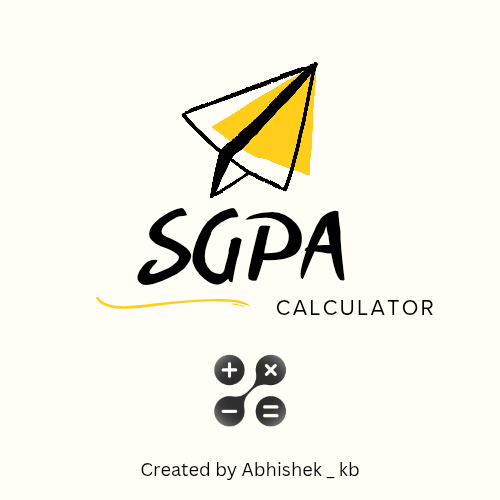
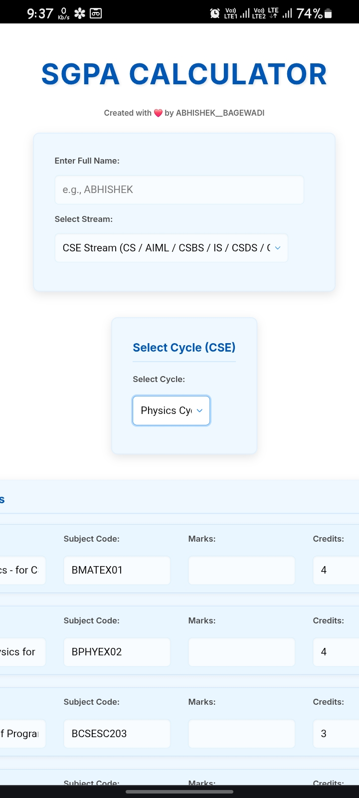
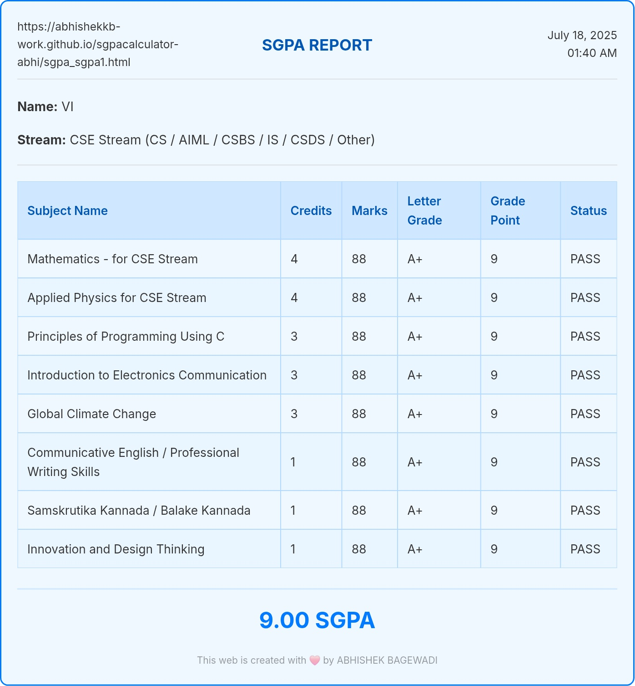
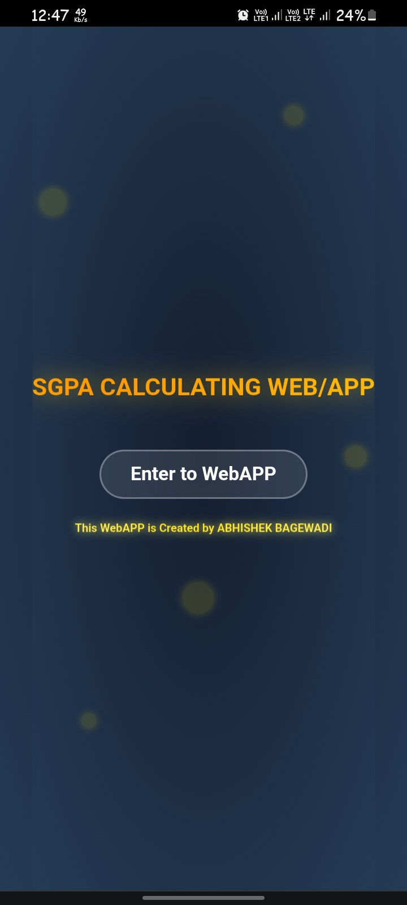

# 🎓 SGPA & CGPA Calculator

<p align="center">
  
</p>

<h3 align="center">A simple and powerful SGPA & CGPA Calculator for engineering students</h3>

<p align="center">
  Calculate your SGPA, generate grade cards, calculate CGPA, and download your results — all in one place.
</p>

<p align="center">
  <a href="https://abhishekkb-work.github.io/sgpacalculator-abhi/">
    <strong>🚀 Try Live Demo</strong>
  </a>
</p>

---

## 🌐 Live Demo

🔗 **Website:**  
https://abhishekkb-work.github.io/sgpacalculator-abhi/

---

## 📸 Screenshots

<p align="center">
  
  
</p>

<p align="center">
  
  
</p>

---

## ✨ Features

### 📊 SGPA Calculator

Calculate your semester SGPA based on:

- Subject marks
- Subject credits
- Grade points
- Letter grades

The calculator automatically calculates the credit-weighted SGPA.

### 🎓 VTU-Oriented Subject Support

The application includes predefined subjects and credits for supported engineering streams and semesters.

Supported options include:

- Computer Science & Engineering
- Electronics & Communication
- Electrical & Electronics
- Physics Cycle
- Chemistry Cycle
- Semester-specific subjects

### 📝 Custom Subjects

Don't see your subject?

You can add your own:

- Subject name
- Marks
- Credits

This makes the calculator useful even when your subjects aren't included in the predefined list.

### 🧾 Grade Card

After calculating your SGPA, you can generate a temporary grade card containing:

- Student name
- Branch / stream
- Subject details
- Marks
- Credits
- Letter grades
- Grade points
- SGPA
- Date and time

### 📄 PDF Download & Sharing

Generate your SGPA grade card as a PDF and:

- Download it
- Share it
- Save it for future reference

### 📈 CGPA Calculator

Calculate your overall CGPA by entering your semester SGPA values.

You can:

- Add multiple semesters
- Enter semester SGPA
- Calculate overall CGPA
- Generate a CGPA report

### 📱 Responsive Design

The website is designed to work on:

- 📱 Mobile phones
- 💻 Laptops
- 🖥️ Desktop computers
- 📟 Tablets

### 🌙 Modern UI

The project includes a clean and student-friendly interface with responsive layouts and visual elements designed for quick calculations.

### 📲 PWA Support

The project includes Progressive Web App components such as:

- Web App Manifest
- Application icons
- Service Worker

This provides support for installing the application as a web app on compatible browsers.

---

## 🧮 SGPA Formula

SGPA is calculated using the credit-weighted formula:

```text
SGPA = Σ(Credit × Grade Point) / Σ(Credit)
